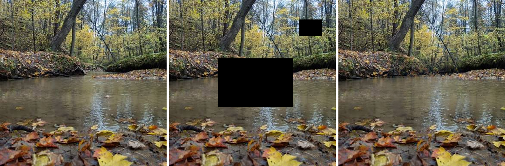

# lama-inpaint

Fast, dependency-light inpainting of objects, damage or watermarks in photos.
A single self-contained binary runs the LaMa FFC ResNet generator on a GPU
(or on the CPU), with no Python, no PyTorch and no CUDA toolkit installed.
The GPU path goes through the [lightgpu](https://github.com/jacobsparts/lightgpu)
toolkit, which resolves everything with `dlopen` at run time, so only a driver
install is needed. Kernels are precompiled into the executable and launched by
name. The SGEMM for the convolution paths is this engine's own kernel
(`k_sgemm_slab`, over im2col patches) and the batched 2-D transforms for the
Fourier units come from the toolkit, so neither cuBLAS nor cuFFT is needed. The
binary links only `libc`, `libm` and `libgcc_s`.

This is a Linux x86-64 release; the GPU path needs an NVIDIA GPU of compute
capability 6.1 or newer, while the CPU engine runs anywhere Rust does.

One of the [lightgpu inference engines](https://github.com/jacobsparts/lightgpu).
The family also includes [rmbg-rs](https://github.com/jacobsparts/rmbg-rs),
[locate-anything-rs](https://github.com/jacobsparts/locate-anything-rs),
[realesrgan-rs](https://github.com/jacobsparts/realesrgan-rs),
[nafnet-rs](https://github.com/jacobsparts/nafnet-rs) and
[maxim-rs](https://github.com/jacobsparts/maxim-rs); every engine pulls
the [lightgpu toolkit](https://github.com/jacobsparts/lightgpu) in as a Git
dependency. Here it supplies the `.safetensors` weight store, the `.cu` build
step, the CUDA context and launch layer, and the 2-D Fourier transforms; this
engine brings its own kernel image for the rest.
[pixeldeck](https://github.com/jacobsparts/pixeldeck) is a local web app for
cleaning up product photos that drives all of these engines.



Two independent backends live in `lama-rs/`:

| engine | file | notes |
| --- | --- | --- |
| CUDA | `src/cuda.rs` | in-house SGEMM (`k_sgemm_slab`) over im2col patches plus custom kernels for the rest, with the batched 2-D Fourier transforms (`lg_fft2_r2c`/`lg_fft2_c2r`), the output-layer sigmoid (`lg_sigmoid`), the plane accumulate (`lg_add_inplace`) and the plane copy (`lg_copy`) taken from the lightgpu toolkit; 0.40 s for 512x512 on a GTX 1080 |
| CPU | `src/cpu.rs` | direct convolution, rayon-parallel - the path taken when there is no GPU, held to the same performance standard as the CUDA one; the two are kept in step at max 1/255, commonly 0 |

The binary runs the generator in **three operating modes**:

* **Plain** — the default. Runs the generator across the whole image. Best for small
  holes; wastes work on large images with tiny masks and fails inside large ones.
* **`--tile`** — crops a square window around the mask, runs the generator on that,
  and pastes the result back. For large images with a **small** hole.
* **`--sections`** — fills a large mask in discrete 256x256 pieces, one 512x512 window
  per piece, from the rim of the hole inward. For images with a **large** hole.

`--tile` and `--sections` are novel enhancements added by this project: they are
not part of the original LaMa algorithm or the PyTorch reference. Both modes
preserve the same strict contract as plain — only masked pixels are taken from the
network — so the mode you choose changes only the geometry of the forward pass.

## Quick start (release binary)

Download one of the two binaries and the weight file from the
[latest release](https://github.com/jacobsparts/lama-inpaint-rs/releases/latest)
into one directory and run:

| release asset | what it is |
| --- | --- |
| `lama-inpaint-linux-x86_64` | the CUDA-enabled binary; needs an NVIDIA driver to use the GPU, and falls back to the CPU engine without `--gpu` |
| `lama-inpaint-linux-x86_64-cpu-only` | CPU-only binary; no CUDA toolkit, driver or GPU is needed, and `--gpu` is refused instead of silently running the CPU engine |

Both read the same weight file and produce the same output on `--cpu`.

```
./lama-inpaint --image photo.png --mask mask.png --output out.png
```

The weights are found next to the executable by default, so no paths are
needed. `--mask` is a PNG in which any non-black pixel marks a hole; the output
is written at the input size.

Use `-` for either input to read that PNG from standard input. The image and
mask cannot both be `-`, because standard input is a single stream. Use
`--output -` to write the result PNG to standard output; progress and
diagnostics remain on standard error.

```sh
cat input.png | ./lama-inpaint --image - --mask mask.png --output - > output.png
```

```
usage: lama-inpaint --image IN.png --mask MASK.png --output OUT.png
                    [--weights big-lama.safetensors]
                    [--cpu | --gpu]
                    [--tile | --sections]

Runs the big-lama FFC ResNet generator over IN.png, inpainting the pixels the
mask marks (any non-black pixel is a hole), and writes OUT.png at the input
size.  Use - for either input (but not both) to read a PNG from stdin, or for
the output to write PNG data to stdout.  Diagnostics always go to stderr.
GPU is used when available unless --cpu is given.
Images at or below 512px on the short side are run whole even with --tile.

--tile runs the network on a square window around the mask instead of the whole
image: the window is twice the mask bounding box, at least 512x512, centred on
the mask and clamped inside the image.

Only the masked pixels are taken from the network, exactly as without --tile, so
the output is identical to cropping the window out by hand, running this binary
on it and pasting the hole back.  Best for large images with small holes, and
best with masks of 256x256 or less.

--sections fills a mask larger than 256x256 in discrete 256x256 sections, one
512x512 window per section, from the edge of the hole inward.  Each pass masks
only its own section and writes back only its own section, so the rest of the
hole is context on purpose: passes read the original pixels (the leak this mode
accepts) and the fills of earlier passes.  The sections tile the mask's bounding
box, so every masked pixel is decided by exactly one pass, and the rim of the
hole is filled before the interior.  The sections are the 256x256 crop the
weights were trained on.
Sections and --tile are mutually exclusive.
```

* `--weights` defaults to `big-lama.safetensors`, searched next to the
  executable, then in a `models/` subdirectory, then up the tree, then the
  current directory.
* `--gpu` makes a GPU failure fatal instead of falling back to the CPU engine
  (~1 minute for a 512x512 image), and the error names the GPU it found, what
  the embedded kernel image carries, and how to reach the CPU path. A pass the
  device cannot hold is refused the same way, before anything is allocated.
* `--tile` runs the network on a square window around the mask instead of the
  whole image. The window is twice the mask's bounding box, at least 512x512,
  centred on the mask and clamped inside the image; images at or below 512px on
  their short side are run whole regardless. Only masked pixels are taken from
  the network, exactly as without `--tile`, so the result is identical to
  cropping the window out by hand and pasting the hole back - see
  [Large images](#large-images---tile).
* `--sections` fills a mask larger than 256x256 in discrete 256x256 pieces, one
  512x512 window per piece, from the rim of the hole inward, so every pass runs
  the network at the scale it was trained for. Every masked pixel is decided by
  exactly one pass; it is a different tradeoff from `--tile`, not a better one -
  see [Large masks](#large-masks---sections).

## Weights

The released weight file is:

| file | size | what it is |
| --- | --- | --- |
| `big-lama.safetensors` | 205 MB | the standard `.safetensors` container: all 989 tensors as little-endian FP32, plus the architecture constants in `__metadata__` |

It is derived from the official big-lama checkpoint by `lama-rs/export_weights.py`,
which is run once and needs PyTorch:

```
python3 lama-rs/export_weights.py big-lama.pt big-lama.safetensors
```

At run time the file is `mmap`ed read-only and the header is parsed to locate
every tensor; each payload is uploaded to the GPU straight out of the mapping,
and the whole blob is one `cuMemcpyHtoD` on the first pass. The original `.pt`
file is not needed afterwards.

## Building from source

To **build** the GPU path you need a Rust toolchain and `nvcc` (set
`NVCC=/path/to/nvcc` if it is not on PATH): `build.rs` compiles this engine's
`cuda/lama.cu` and the toolkit kernels it calls, and the results are embedded in
the binary. To **run** it you need none of that - the image carries SASS for
compute 6.1, 7.5 and 8.0 plus PTX for 8.0, so a driver install is the only
requirement, and a card newer than 8.0 JITs the PTX itself.

```
cd lama-rs
cargo build --release
```

Without a toolkit at all, `cargo build --release --no-default-features` builds
the CPU-only engine.

The kernel set is split in two, and `build.rs` compiles each half with its own
`--entries` list so no unused kernel is embedded: `cuda/lama.cu` holds
big-lama's own kernels, and the shared
[lightgpu](https://github.com/jacobsparts/lightgpu) toolkit supplies the
batched 2-D Fourier transforms, the final output layer's sigmoid (`lg_sigmoid` -
this engine's `k_sigmoid` was that kernel exactly, so it is gone), the in-place
plane accumulate (`lg_add_inplace`) and the plain plane copy (`lg_copy`; the
toolkit is also where the safetensors reader comes from). Nothing in that list is
there by accident: every name in it is an operation this engine once defined for
itself and that turned out to be the toolkit's, which is the point of a shared
kernel set. The two fatbins are loaded as
two modules, and every launch goes through `lightgpu::vm` by kernel name.
Editing either source triggers a rebuild.

The image carries SASS for compute 6.1, 7.5 and 8.0, so those cards run the
kernels directly, plus PTX for compute 8.0 so a **newer** card still works
without rebuilding: the driver compiles that PTX itself. A PTX entry only ever
applies to a device at least as new as its `.target`, and is ignored whenever
matching SASS is present, so the two parts do not overlap - the SASS is what
keeps Pascal through Ampere free of JIT. On a card newer than 8.0 the kernels
are JIT-compiled at load instead; measured on this machine against the SASS
build, that path is bit-identical and indistinguishable in time - the compile is
paid once per process. Adding a new architecture means one entry in
`DEFAULT_ARCHES` (`lightgpu_build`, or `LA_CUDA_ARCH` for a one-off build).

## GPU requirements

Any NVIDIA GPU of compute capability 6.1 or newer.

If the running GPU has no code in the binary at all, the error says which GPU it
is and what the image carries. Cards newer than the SASS targets are covered by
the embedded PTX, so the binary keeps working on hardware that did not exist
when it was built.

Under `--gpu`, a pass the device cannot hold is refused before anything is
allocated, with the estimated need, the free and total device memory, and the
flag to use instead: a `--tile` window is sized from the mask, so a large mask
can ask for a window far bigger than the card holds (peak use is about 1.1 GiB
per megapixel of window, so a 3472x3472 window needs ~13 GB). `--sections` caps
every pass at 512x512, and the plain path needs the whole image, so the hint
names whichever of those fits better. Without `--gpu` the run is left alone: a
card that cannot hold the pass falls back to the CPU engine, as it does for any
other GPU failure.

## Performance

512x512, GTX 1080 (8.9 TFLOPS FP32):

| | time |
| --- | --- |
| this binary, GPU | **0.4 s** (0.45 s whole process) |
| this binary, CPU (`--cpu`) | ~58 s |
| PyTorch, warm forward | 0.115 s |
| PyTorch, whole process | 2.4-3.1 s (1.0 s of it model construction) |

For one image per process - the way the service calls it - the standalone
binary is several times faster end to end; PyTorch only wins per forward pass
once a warm model already exists in memory.

## Large images (`--tile`)

The generator was trained on 256x256 and 512x512 crops and its receptive field
is a few hundred pixels, so on a 2048x2048 photo a small hole gets no more
context than it would at 512 - while the whole-frame forward pass costs 12x
more and, because the mask occupies a smaller fraction of the frame, often
produces *worse* fill: the network has to invent texture at a scale it never
saw in training.

`--tile` crops a square window around the mask, runs the network on that, and
pastes the result back:

```
./lama-inpaint --image big.png --mask mask.png --output out.png --tile
```

* The window is centred on the mask's bounding box and sized to **twice the
  longer side** of that box, never less than 512x512, rounded to a multiple of
  8 (the network has three stride-2 stages) and clamped inside the image.
* Only masked pixels are taken from the network; every other pixel is copied
  from the input. Cropping therefore changes nothing about how masked and
  unmasked areas are treated, and the output is byte-for-byte what you would
  get by cropping the window out by hand, running the binary on it, and pasting
  the hole back.
* Images at or below 512px on the short side are run whole even with `--tile`,
  so it is always safe to pass the flag.

A 300x300 mask in a 2048x2048 image gives a 600x600 window:

| | window | time (GTX 1080) |
| --- | --- | --- |
| without `--tile` | 2048x2048 | 4.58 s |
| with `--tile` | 600x600 | **0.67 s** |

Best results come from masks of 256x256 or smaller, which is also the regime the
weights were trained on.

## Large masks (`--sections`)

`--tile` does not help when the hole itself is large - the window is then the
whole image again. A mask well beyond 256x256 is also outside the regime the
weights were trained on, and a single pass over a big hole invents texture at a
scale the network never saw. `--sections` fills such a mask in discrete 256x256
pieces, one 512x512 window per piece, so every forward pass sees a hole the size
the weights were trained for:

```
./lama-inpaint --image big.png --mask bigmask.png --output out.png --sections
```

* Pieces are filled **from the rim of the hole inward**, so the early passes
  have the real image around the whole boundary of their piece and the later
  ones are surrounded by fill.
* **Each pass masks only its own piece.** The rest of the hole is left unmasked
  on purpose: the network sees the original content there, which gives it
  something continuous to work from instead of a hard 512-wide hole.
* Pieces **tile the mask's bounding box** a whole 256x256 block at a time, so
  every masked pixel is written by exactly one pass.
* `--sections` and `--tile` are mutually exclusive. Either flag on an image at or
  below 512px on its short side runs the whole image instead, with a note.

Measured on a 1000x667 photo (350x270 mask across a boardwalk), with the four
piece boundaries set by the mask's bounding box:

| | discontinuity across a piece boundary | interior control |
| --- | --- | --- |
| `--sections` | 20.7 / 12.3 | 18.2 / 15.1 |

The two figures are the mean absolute step across the vertical and horizontal
boundaries, over masked pixels either side; the controls are the same measure
across an interior line 64px away. Neither boundary stands out against the fill
around it, so the piece edges are not visible as seams on this image. On a
1024x1024 image with a 399x299 solid ellipse the filling behaves as the
mechanism predicts instead: 79% of the hole's pixels end up more than a quarter
of the way toward the object's colour, because past ~100px inside the hole every
pass is handed pieces that are still original object.

**What this means in practice:** `--sections` is for large masks that are thin or
textured enough that the original content reads as background around each piece.
For a large *solid* object - a sign, a logo, a whole person - it reproduces the
object inside its own hole; `--tile` (or the plain whole-image path) is not
merely better there, it is close to exact. Try `--tile` first: if the window is
much larger than 512x512, `--sections` is the alternative, with the caveat above.

## Verification

Every change is checked against two fixed references:

| comparison | max | mean |
| --- | --- | --- |
| CUDA engine vs PyTorch reference | 1/255 | 0.072606 |
| CUDA engine vs Rust CPU engine | 1/255 | 0.000052 |
| Rust CPU engine, rerun | 0 | 0.000000 (bit-identical) |
| Rust CPU engine, weights re-exported as `.safetensors` | 0 | 0.000000 (bit-identical PNG) |
| CUDA engine, weights re-exported as `.safetensors` | 1/255 | 0.000048 |

```
./lama-inpaint --image testdata/in.png --mask testdata/mask.png --output /tmp/out.png
```

## Profiling

`LAMA_PROFILE=1` prints a per-phase breakdown (context setup, weight upload,
step loop, download, totals). Finer instruments: `LAMA_PROFILE_OPS`,
`LAMA_PROFILE_SUB`, `LAMA_PROFILE_SYNC`, `LAMA_DUMP_STEP=n`, `LAMA_FFT_HOST`,
`LAMA_CONVT_GATHER`, `LAMA_NO_POOL`,
`LAMA_DUMP_SECTIONS=dir` (snapshot each `--sections` pass as a PNG). Without
`LAMA_PROFILE_SYNC`, per-step timings measure submission only.

## Credits and licence

The model architecture and the `big-lama` weights come from the
[saicinpainting](https://github.com/advimman/lama) project (Apache-2.0);
`big-lama.safetensors` is a repacking of that checkpoint, not a new model.
`--tile` and `--sections` are additions of this project and are not part of the
original algorithm. The code in this repository is Apache-2.0 - see `LICENSE`.
