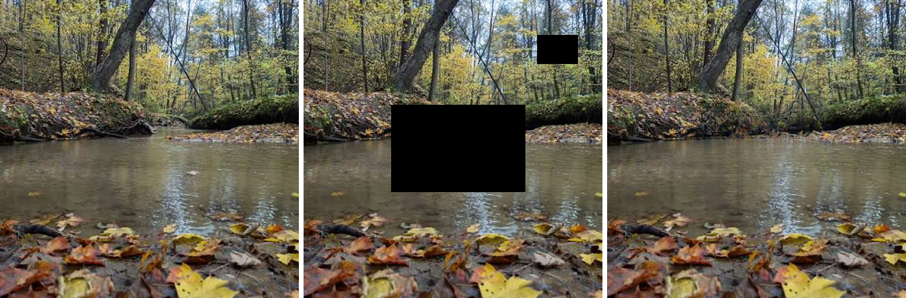

# lama-inpaint

One of the [lightgpu inference engines](https://github.com/jacobsparts/lightgpu).

LaMa inpainting in one self-contained binary: feed it a photo plus a mask marking
a hole (an object, damage or a watermark) and get the photo back with the hole
filled from its surroundings. No Python, PyTorch, ONNX Runtime, or CUDA toolkit
needed.



```sh
lama-inpaint --image photo.png --mask mask.png --output out.png
```

* Both backends in one executable: a pure-Rust CPU path and a CUDA path with
  hand-written kernels. The GPU is used when the CUDA driver can be brought up
  and the CPU path when it cannot; `--cpu` selects the CPU path explicitly and
  `--gpu` refuses to fall back.
* 1.4 MiB binary, statically linked except `libc`, `libm` and `libgcc_s`;
  `libcuda.so.1` is `dlopen`ed, so no driver is required on disk.
* Three operating modes, chosen by flag: the plain whole-image pass, `--tile`
  for a small hole in a large image, and `--sections` for a large hole. The last
  two are additions of this project, not part of the original LaMa algorithm;
  both preserve the strict contract that only masked pixels come from the
  network.

Both backends agree with the upstream PyTorch reference to 1/255 (mean
0.07 levels); CPU reruns are bit-identical.

## Download

Prebuilt binary and the weight file are attached to the
[release](https://github.com/jacobsparts/lama-inpaint-rs/releases).

| asset | what it is |
|---|---|
| `lama-inpaint-linux-x86_64` | the engine: x86-64 Linux, glibc >= 2.34; the GPU path needs a compute capability 6.1+ GPU |
| `big-lama.safetensors` | the 205 MB weight file (all 989 tensors, FP32) |

```sh
chmod +x lama-inpaint-linux-x86_64
./lama-inpaint-linux-x86_64 --image photo.png --mask mask.png --output out.png
```

The weights are found next to the executable by default (also in `models/` and up
the tree), so no paths are needed. `--mask` is a PNG in which any non-black pixel
marks a hole; the output is written at the input size. `-` reads or writes a PNG
on stdin/stdout (image and mask cannot both be `-`).

## Usage

```sh
lama-inpaint --image in.png --mask mask.png --output out.png            # whole image
lama-inpaint --image big.png --mask small.png --output out.png --tile   # small hole, big image
lama-inpaint --image big.png --mask big.png   --output out.png --sections  # large hole
```

| flag | meaning |
|---|---|
| `--image` / `--mask` / `--output` | the photo, the mask PNG (non-black = hole), the result; `-` = stdin/stdout |
| `--weights` | path to `big-lama.safetensors` (default: next to the executable) |
| `--cpu` / `--gpu` | force the CPU path; `--gpu` makes a GPU failure fatal instead of falling back |
| `--tile` | run on a square window around the mask instead of the whole image |
| `--sections` | fill a mask larger than 256x256 in discrete 256x256 pieces |

## Large images (`--tile`)

The generator was trained on 256x256 and 512x512 crops, so on a 2048x2048 photo a
small hole gets no more context than it would at 512 - while the whole-frame pass
costs 12x more and often produces a *worse* fill, because the network has to
invent texture at a scale it never saw in training. `--tile` crops a square
window around the mask, runs the network on that, and pastes the result back. The
window is centred on the mask's bounding box and sized to twice its longer side,
never less than 512x512, clamped inside the image; images at or below 512px on
the short side are run whole regardless. Only masked pixels are taken from the
network, so the result is byte-for-byte what cropping the window by hand, running
the binary on it and pasting the hole back would give. A 300x300 mask in a
2048x2048 image goes from 4.58 s to 0.67 s on a GTX 1080.

## Large masks (`--sections`)

`--tile` does not help when the hole itself is large - the window is then the
whole image again, and a hole well beyond 256x256 is outside the regime the
weights were trained on. `--sections` fills such a mask in discrete 256x256
pieces, one 512x512 window per piece, from the rim of the hole inward, so every
forward pass sees a hole the size the weights were trained for. Each pass masks
only its own piece: the rest of the hole is left unmasked on purpose, as context,
and reads the original pixels plus the fills of earlier passes. `--sections` and
`--tile` are mutually exclusive. The caveat: for a large *solid* object (a sign,
a logo, a whole person) the mode reproduces the object inside its own hole,
because past ~100px inside the hole every pass is handed pieces that are still
original object - use `--tile` there instead.

## Licence and attribution

The model architecture and the `big-lama` weights come from the
[saicinpainting](https://github.com/advimman/lama) project (Apache-2.0);
`big-lama.safetensors` is a repacking of that checkpoint, not a new model.
`--tile` and `--sections` are additions of this project. The code in this
repository is Apache-2.0 - see `LICENSE`.
